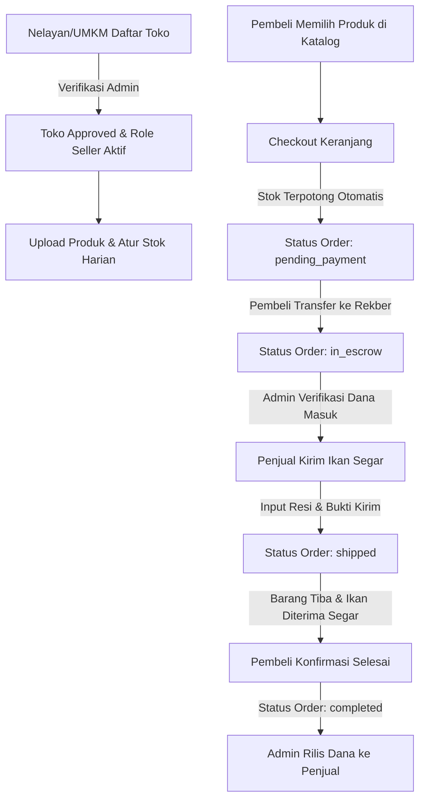

# PROPOSAL & DESKRIPSI PLATFORM "JARINGLOKAL"
**Tema: WDC 2026 — UMKM GOES DIGITAL**

---

### Informasi Tim & Proyek
- **Nama Tim:** blup blup
- **Anggota 1:** Hiu *(Product Designer & Frontend Developer)*
- **Anggota 2:** Paus *(Backend & System Architecture)*
- **Nama Proyek / Platform:** JaringLokal (AerLaut) — Platform Distribusi Digital Hasil Laut & Ekosistem UMKM Pesisir Berbasis Escrow Real-Time
- **Tautan Proyek:**
  - **GitHub:** [https://github.com/derrick0930/JaringLokal](https://github.com/derrick0930/JaringLokal)
  - **Live Preview / Deploy:** [https://jaringlokal.vercel.app/](https://jaringlokal.vercel.app/)

---

## 📌 Format Ringkas / Submission Pengumpulan (Sesuai Format Formulir)

```text
Nama Tim: blup blup
Anggota1 : Hiu
Anggota2 : Paus

Nama Proyek / Platform: JaringLokal - Platform Distribusi Hasil Laut & Digitalisasi UMKM Pesisir

Latar Belakang & Penjelasan Singkat:
Di wilayah pesisir Indonesia, para nelayan tradisional dan pelaku UMKM olahan hasil laut (seperti pengrajin terasi, ikan asap, dan bandeng presto) masih sangat bergantung pada rantai perantara tengkulak yang panjang (3–5 lapisan). Kondisi ini menyebabkan nelayan hanya menerima harga jual yang sangat rendah, sementara konsumen akhir dan restoran harus membayar harga tinggi untuk komoditas laut yang kualitas dan kesegarannya sudah menurun akibat distribusi yang lambat. Di samping itu, pencatatan stok masih dilakukan secara manual di buku tulis dan transaksi jarak jauh sangat rentan terhadap penipuan.

Berangkat dari masalah tersebut, kami merancang JaringLokal, sebuah platform distribusi digital hasil laut dan ekosistem manajemen toko yang didesain khusus agar mudah dioperasikan oleh nelayan dan komunitas pesisir. Melalui platform ini, nelayan dan UMKM memiliki etalase digital dengan sistem manajemen stok (CRUDS) otomatis yang langsung tersinkronisasi saat terjadi pembelian. Untuk menjamin rasa aman bertransaksi jarak jauh, JaringLokal dilengkapi dengan Sistem Rekening Bersama (Escrow 3-Pihak: Pembeli - Penjual - Admin) yang terintegrasi dengan ruang diskusi pesanan real-time (Live Order Chat).

Proyek ini kami kembangkan menggunakan React 19, Vite, dan Tailwind CSS untuk menghasilkan antarmuka pengguna bernuansa maritim yang modern, cepat, dan sangat responsif di smartphone nelayan. Untuk memastikan sinkronisasi data transaksi, inventori, tiket bantuan otomatis, serta log demografi pengunjung secara real-time, kami mengintegrasikannya dengan Supabase (PostgreSQL 15 & Realtime WebSocket). Harapannya, JaringLokal dapat menjadi motor penggerak digitalisasi maritim dan menaikkan kesejahteraan masyarakat pesisir Indonesia.

Tautan Proyek:
GitHub: https://github.com/derrick0930/JaringLokal
Live Preview / Deploy: https://jaringlokal.vercel.app/
```

---

## 📑 Proposal Lengkap: Cara Kerja, Arsitektur & Fitur Platform

### 1. Latar Belakang & Masalah
1. **Rantai Pasok Panjang (3–5 Lapisan Tengkulak):** Nelayan di pesisir (seperti Tuban) menjual ikan dengan harga murah, sementara harga di pasar kota melambung tinggi.
2. **Pencatatan Konvensional:** Stok hasil tangkapan harian dicatat manual, berisiko selisih stok dan pembusukan ikan sebelum terjual.
3. **Ketidakpercayaan Transaksi Jarak Jauh:** Pembeli takut barang tidak dikirim atau tidak segar, sementara nelayan takut pembeli tidak membayar.
4. **Keterbatasan Akses Pasar Olahan Pesisir:** Produk olahan ibu-ibu pesisir (terasi super, kerupuk laut, ikan asap) sulit menjangkau pasar luar kota.

---

### 2. Tujuan & Sasaran Proyek
- **Mempersingkat Rantai Distribusi:** Memangkas perantara dan meningkatkan pendapatan bersih nelayan mitra hingga 30%.
- **Digitalisasi Stok Harian (Boat-to-Table):** Menyediakan etalase digital dengan pemotongan stok otomatis saat checkout (*auto-deduction*).
- **Keamanan Transaksi dengan Escrow 3-Pihak:** Menjamin dana pembeli aman di rekening bersama admin sampai produk diterima segar.
- **Transparansi & Dukungan Pengguna:** Menyediakan ruang obrolan pesanan real-time, tiket bantuan otomatis (auto-close 7 hari inaktif), serta analitik persebaran pengunjung.

---

### 3. Cara Kerja Sistem (Workflow)



1. **Pendaftaran Toko (Store Approval Flow):**
   - Pengguna mengajukan toko baru melalui `SellerRegister`.
   - Admin memeriksa profil toko di Admin Hub (`Stores.jsx`) dan menentukan status (`pending` -> `approved` / `rejected`).
   - Saat disetujui, role akun otomatis berubah menjadi `seller`.

2. **Manajemen Produk & Stok Real-Time (Live CRUDS):**
   - Penjual mengelola katalog: Tangkapan Segar (*Rajungan, Cumi, Udang, Kerapu*) & Olahan (*Terasi, Ikan Asap, Bandeng Presto*).
   - Saat pembeli melakukan checkout, sistem langsung memotong kuantitas stok di database Supabase secara real-time.

3. **Mekanisme Rekening Bersama (Escrow 3-Pihak):**
   - `pending_payment`: Pembeli mentransfer dana ke rekening bersama admin.
   - `in_escrow`: Admin memverifikasi dana; dana aman ditahan sistem. Penjual mendapatkan instruksi menyiapkan produk.
   - `shipped`: Penjual mengirimkan komoditas laut dan memasukkan catatan kurir.
   - `completed`: Pembeli mengonfirmasi barang diterima; dana escrow diteruskan ke nelayan/penjual.

4. **Ruang Diskusi Pesanan Terpadu (Live Escrow Chat):**
   - Setiap pesanan memiliki kanal obrolan khusus antara Pembeli, Penjual, dan Admin untuk koordinasi jam sandar kapal, foto kesegaran ikan, dan kendala pengiriman.

5. **Layanan Bantuan & Otomatisasi Tiket 7 Hari:**
   - Pengguna dapat mengirimkan tiket kendala di Support Hub.
   - Jika tiket tidak memiliki aktivitas balasan selama 7 hari (1 minggu), sistem otomatis menutup tiket dengan pesan auto-reply dan status `Selesai`.
   - Terdapat jalur darurat WhatsApp Direct Admin untuk kendala pra-login atau pemulihan akun.

6. **Analitik Transaksi & Demografi Pengunjung (Visitor Geo-Tracking):**
   - Platform mencatat aktivitas secara anonim (IP address, kota/wilayah, tipe perangkat Mobile/Desktop).
   - Menyediakan fitur *Dynamic QR Code Generator* per produk/toko untuk promosi fisik di dermaga atau kemasan produk UMKM.

---

### 4. Spesifikasi Teknologi

| Komponen | Teknologi | Keterangan |
| :--- | :--- | :--- |
| **Frontend UI** | React 19, Vite, Tailwind CSS | Single Page Application (SPA), desain maritim elegan, responsif mobile |
| **Ikon & Komponen** | Lucide React, clsx, tailwind-merge | Komponen UI modular dan konsisten |
| **Database & Auth** | Supabase (PostgreSQL 15) | Tabel `users`, `stores`, `products`, `orders`, `order_chats`, `user_logs`, `support_tickets` |
| **Realtime Engine** | Supabase Realtime (WebSocket) | Live broadcast chat order, status escrow, dan pembaruan stok |
| **Keamanan** | Cloudflare Turnstile, reCAPTCHA v3, RLS | Pencegahan bot spam, validasi input, dan Row Level Security |
| **Dokumen Word** | `docx` npm library | Generator file proposal Word resmi (`.docx`) |

---

### 5. File Dokumen yang Dihasilkan
Dokumen proposal resmi berformat Microsoft Word telah dibuat di direktori proyek:
- 📄 **File Word:** [`PROPOSAL_JARINGLOKAL.docx`](file:///c:/Users/Hype%20AMD/Documents/AerLaut/PROPOSAL_JARINGLOKAL.docx)
- 📝 **File Markdown:** [`PROPOSAL_JARINGLOKAL.md`](file:///c:/Users/Hype%20AMD/Documents/AerLaut/PROPOSAL_JARINGLOKAL.md)
